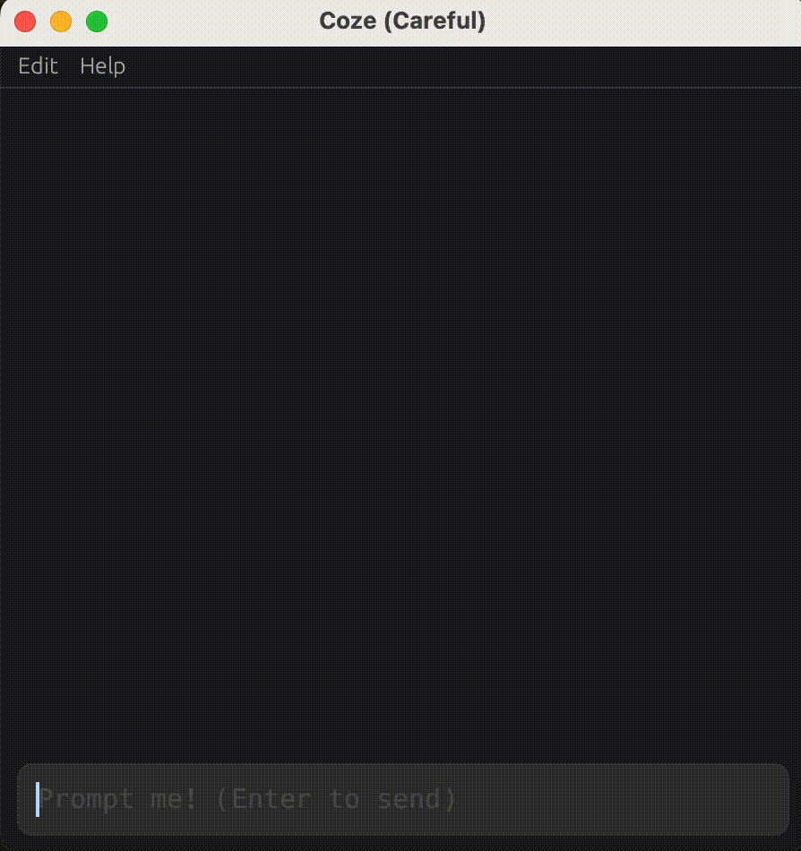

# An egui app for prompting a local offline LLM.

<p align="center">
  
</p>

## Description

`coze` is a small [`egui`](https://github.com/emilk/egui) application for prompting
a local offline LLM using the Huggingface [`candle`](https://github.com/huggingface/candle)
crate.

Currently it uses a [quantized version](./model/README.md) of the
[StableLM 2 Zephyr 1.6B](https://huggingface.co/stabilityai/stablelm-2-zephyr-1_6b)
model that is a relatively small model that is fun to use.

The current version supports:

- Prompt history navigation with fuzzy matching.
- History persistence across runs.
- Token generation modes.
- Copy prompts and replies to clipboard.
- Light/Dark mode.

See the app `Edit/Config` menu for usage details.

## Installation

Binaries generated by the release Github action for Linux, macOS, and
Windows are available in the [releases page][github-releases].

[github-releases]: https://github.com/vincev/coze/releases/latest

To build locally you need `git lfs` (debug build may be very slow):

```bash
git lfs install
git clone https://github.com/vincev/coze
cd coze
cargo r --release
```
